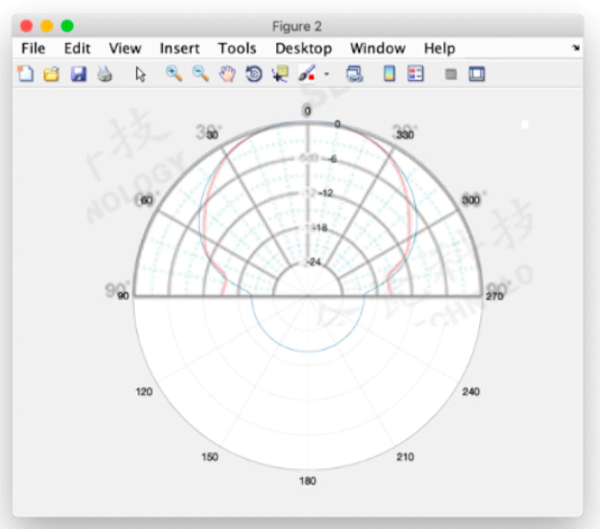

# Simulation Algorithm Documentation

[TOC]

## Simulation 

Details of our simulation can be found in the paper. Here, we expand and document its code, which we plan to release for future researchers to build upon.  


### Overview

Generally speaking, our simulation is a simple 3D ray tracing engine with a transducer-array placed at the origin (x=0,y=0,z=0). For a 3D location $p$, the mean sound pressure in a period of time, $\overline{P(p)}$, can be calculated as:

$$
\overline{P(p)} = \sqrt{ \frac{1}{|T|} \cdot \sum_{t \in T}{P_{t}(p)^2}}
$$

We sampled $0.4s$ with $0.013573s$ time step, which was intentionally chosen because it can not be divided by $1/fs$ (where $fs=25kHz$ in our case). $0.4s$ was chosen because it matches the speech rate in a conversation.

The total far field generated by all the transducers at time $t$ can be computed as the summation of the contribution of each indidvidual transducer
$$
P_t(p) = \sum_{s \in S}{P_{t,s}(p)}
$$


### Calculating $P_{t,s}(p)$

$$
P_{s,t}(p) = P_{ref} \cdot gain \cdot
               f_s(t - \frac{d(p, p_s)}{c_0})
$$

where $gain$ represents how the signal attenuate; $d(p, p_s)$ is the distance between the transducer and the point, and $f_s(t)$ represents the signal transmitted by a transducer $s$ at time $t$.

$P_{ref}$ is the reference pressure at 1m. We first measured sound pressure level at 1m and then use the following equation to calculate $P_{ref}$:

$$
P_{ref} = 10^{(L_A / 20)} * 0.00002\ Pa
$$

Here, $L_A=68dBA$ and $P_{ref} = 0.05024 \ Pa$.

### Calculating $gain$

$gain $ consists of 2 parts: (1) directivity of the transducer, (2) propagation loss with distance.

$$
gain = loss_{directivity} * loss_{distance}
$$


#### (1) Transducer directivity loss: $loss_{directivity}$

We model transducers as a piston source:


$$
loss_{directivity} = \frac{2 \cdot J_1(k \cdot r \cdot sin \theta)}{k \cdot r \cdot sin \theta}
$$

We also compared the directivity pattern from the datasheet with the one we modeled: (blue line means the modeled pattern, red line is the one from datasheet)



*For 90 to 270 degree, the original pattern is not available; we simply repeat the value at 90 degree at this range.*

#### (2) Propagation loss with distance: $loss_{distance}$

The propagation loss can be calculated as
$$
loss_{distance} = \frac{1}{d(p, p_s)}
$$

### Simulating rotation of a transducer array

Lastly, the previous explanation is how we simulate a static array. To add movement (e.g., rotation) to a transducer array, we do as follows: at each simulation step, a new position and orientation of a transducer is updated before calculating its resulting signal amplitude. For any given 3D location and transducer, its new position (and rotation) may increase or decrease $gain$, resulting in a stronger or weaker power. This rotation and its effects is how movement of a tranducer might assist in reducing blind spots.

## Running the simulator

To run our simulator, load our ``simulation_v3.m`` in MatLab (we used R2017b) and run it.

#### Exemplary simulation 

```matlab
xy_res = 0.002;

%%% To replicate the figures shown in nour simulation section in our paper, simply choose one of the options below (and comment the others)

%%% fig a 
num_sources = 1; rotate_angle = 0; planar_layout = 1;
simulation_v4;
%%% fig b 
num_sources = 1; rotate_angle = 0; planar_layout = 0;
simulation_v4;
%%% fig c 
num_sources = 9; rotate_angle = 0; planar_layout = 0;
simulation_v4;
%%% fig d 
num_sources = 1; rotate_angle = 15; planar_layout = 0;
simulation_v4;
```


